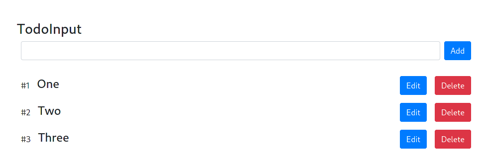

# Reactjs TodoList Redux (CRUD App)

Build A Todo List App with React with Class (Including Hooks, Redux)

[](https://basemax.github.io/reactjs-todolist-redux)

## Try & Demo

View preview at: https://basemax.github.io/reactjs-todolist-redux

or build:

```bash
$ git clone https://github.com/BaseMax/reactjs-todolist-redux
$ cd reactjs-todolist-redux
$ npm install
$ npm start
```

## Similar Repository

- https://github.com/BaseMax/reactjs-todo-list
- https://github.com/BaseMax/reactjs-todolist

### Acknowledgment

I saw an [Youtube video](https://www.youtube.com/watch?v=xwkbWUOGfws) and It's encouraged me to write a similar project myself.

© Copyright Max Base

